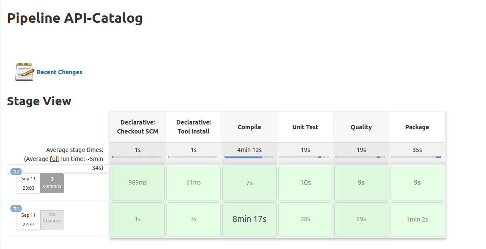

# Manning TWA - Testing for Microservices - CI

This project contains all the files related with the CI of the live series of “Testing for Microservices”.

## Table of contents

The following are the most important topics in this file:
- [Requirements](#Requirements)
- [Structure](#Structure)
  - [Jenkins](#Jenkins)
  - [Sonar](#Sonar)  
- [Pipeline Steps](#pipeline-steps)
- [Run the CI](#run-the-ci)
- [Considerations](#Considerations)
- [Further readings](#further-readings)

### Requirements

To use these tools you need to have in your machine the following things:
- [Git](https://git-scm.com/)
- [Docker](https://www.docker.com/)

If you don't have some of these tools in your machine installed, please follow the instructions in the official documentation of each tool.

### Structure

The CI use [Jenkins](https://www.jenkins.io/) which is one of the most used tools. Also, during the execution of the pipeline Jenkins calls to [Sonarqube](https://www.sonarqube.org/) which contain all the information about the quality of each microservice. 

To reduce the complexity in the configuration most of these tools are preconfigured with the microservices that are connected with **TWA**. The only thing that you need to do is build and run the dockerfiles and open a browser.

#### Jenkins

As I mentioned in the previous paragraph, Jenkins is one of the most used tools for automated a process like CI. The idea is to execute a series of steps to validate that everything is okay in one artifact (library or microservice).

The following image shows you the general view that you can see when ingress in the Jenkins.

If you click on any of the microservices will appears a page with all the steps of the pipeline.

If you want to obtain more information you can check more information about the execution of the pipeline.

Finally, if something happens during the execution of one particular pipeline you can check the console with the logs of the execution.

#### Sonar

SonarQube offers to developers a way to validate and check the quality of the artifacts (libraries or microservices), to do this you can create different rules which validate different aspects that the maximum number of bugs or the minimum coverage of the test.

The following image shows you the general view that you can see when ingress in the SonarQube.

As you can see in the previous image contains all the information related to the quality like the number of bugs, coverage of the testing. You can configure the different **quality gates** to show when everything is okay in the project. For the proposes of the situation of the **TWA** only have the default configuration.

If you click on any of the microservices will appears a page with more information about the quality of the new code versus the previous one.

### Pipeline Steps

As you can see on the following image the pipeline have a certain number of steps, each of them do a specific task.

* **Declarative: Checkout SCM** - This step will download the code and very if the form of the pipeline is correct or not.
* **Declarative: Tool install** - This step will download and configure all the libraries or job to run the following steps that of the pipeline. 
* **Compile** - This step will try to compile the entire code of the microservices. To do this execute the command 'mvn compile'
* **Unit Test** - On this step the pipeline will run the unit test using the command 'mvn test'.
* **Quality** - On this step the pipeline will publish to Sonar all the metrics about the project like code coverage, possible bugs. 
* **Package** - This step create the executable to run the application, basically run the command 'mvn package' 

### Run the CI

To run CI, please follow these steps:
1. Clone the repository using this command **git clone git@github.com:behind-code-lines/twa-ci.git**
2. Open a terminal in the directory of the CI and run **docker-compose build** this command builds some images that exist in the repository. After doing that, run **docker-compose up** to run all the tools.
3. If everything works fine, open a web browser in the URL which appears in the documentation section.
- [Jenkins](http://localhost:18080/)
- [Sonar](http://localhost:19000/projects)

### Considerations

There are some considerations in the use of these tools:

1. Some tools of this CI could have some problems with the limit of virtual memory. When you run the dockerfiles, check if some errors appear in the console related to "Max virtual memory areas vm.max_map_count [65530] is too low, increase to at least..". The solution for this kind of problem in Linux/Mac OS run the following command in the console:
   **sysctl -w vm.max_map_count=262144** 
   
2. This repository contains all the configurations to run the pipeline and check the quality of the code without the need to change something.
3. Jenkins does not have any password so you can write the URL in the browser and you will see the general view of the tool. In the case of SonarQube, the password is **asa123**
4. The definition of the steps in each pipeline exists in this [repository](https://github.com/behind-code-lines/twa-api). If you want to change the location of the repository where Jenkins obtains the information of the pipeline, open each file in the folder **jenkins/jobs** and change the URL of the repository.

#### Further readings

It is not the idea of this repository bring all the information about the pros/cons or more information about the tools that appear here, for that reason the following links could help you to clarify any doubt that you have:

- [Jenkins configuration](https://www.vogella.com/tutorials/Jenkins/article.html)
- [Sonarqube configuration](https://blog.setapp.pl/sonarqube_introduction)
- [Pipeline as code - Manning.com](https://www.manning.com/books/pipeline-as-code?query=jenkins)

