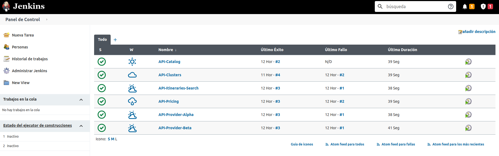

# Manning TWA - Testing for Microservices - CI

This project contains all the files related with the CI of the live series of “Testing for Microservices”.

## Table of contents

The following are the most important topics in this file:
- [Requirements](#Requirements)
- [Structure](#Structure)
  - [Microservices](#Microservices)
  - [Layers](#Layers)  
  - [Model](#Model)
  - [Flow](#Flow)
  - [Technologies](#Technologies)
  - [Errors definition](#errors-definition)
  - [Internal libraries](#internal-libraries)
- [Run the APIs](#run-the-apis)
- [Documentation of APIs](#documentation-of-apis)
- [Considerations](#Considerations)

## Requirements

To use these tools you need to have in your machine the following things:
- [Git](https://git-scm.com/)
- [Docker](https://www.docker.com/)

If you don't have some of these tools in your machine installed, please follow the instructions in the official documentation of each tool.

## Structure

The CI use [Jenkins](https://www.jenkins.io/) which is one of the most used tools. Also, during the execution of the pipeline Jenkins calls to **[Sonarqube](https://www.sonarqube.org/)** which contain all the information about the quality of each microservice. 

#### Jenkins

As I mentioned in the previous paragraph, Jenkins is one of the most use it tools for automate process like CI. The idea is execute a series of steps to validate that everything is okay in one artifact (library or microservice).

#### Sonar

#### Microservices

The system comprises the following microservices:
* **api-catalog** is a microservice containing all information about which are the valid cities to find flights. This API only returns a certain amount of flights that are required in the request, to get the next page of results without doing a new search, all the results will save it in a database with a TTL.
* **api-clusters** is a microservice containing all the validations about the parameters of the search. Also, call **api-pricing** to get the final price of each itinerary.
* **api-pricing** is a microservice containing all the rules to add a markup of each itinerary and calculate the final price of each of them.
* **api-itineraries-search** is a microservice containing all logic, of which providers need to call to get all the itineraries. Also, this microservice removes duplicates.
* **api-provider-alpha** is a microservice that simulates to get the information of an external provider.
* **api-provider-beta** is a microservice that simulates to get the information of an external provider.

The following picture illustrates the architecture described above.

### Layers

All the microservices are split in different layers which only have access to others layers. The following figure show you the common structure in all the microservices:

Now, a little about what contain each layer:

| Layer                      | Description                                                                                                             | Packages                                              | Example                           |
|----------------------------|-------------------------------------------------------------------------------------------------------------------------|-------------------------------------------------------|-----------------------------------|
| Controllers                | Contain all the endpoints of the microservices                                                                          | *.controller                                          | UserController                    |
| Resources                  | Contain all documentation about the microservices like definition of the endpoints and Swagger                          | *.controller.documentation                            | UserResources                     |
| Request/Response           | In this layer you can find the Data Transfer Object (DTO) that are using across the different layers                    | *.dto.request, *.dto.response                         | UserRequest, UserResponse         |
| Services                   | Contain all the definition of the services and the implementation                                                       | *.service and *.service.impl                          | IUserService, UserService         |
| Validators                 | Contain all the logic to validate a Request of a DTO                                                                    | *.validator                                           | UserValidator                     |
| Repositories               | This layer contain the definition using interfaces and in some cases contain the specification to do a particular query | *.repository, *.repository.impl, and *.specification  | UserRepository, UserSpecification |
| Connectors                 | Inside this layer there are all the communications to external microservices or system.                                 | *.connector                                           | UserConnector                     |
| Connector Configuration    | Inside this layer there are all the configurations related with connectors to external services.                        | *.connector.configuration                             | UserConnectorConfiguration        |
| Helpers                    | All the classes that help in different things in the entire microservices                                               | *.helper                                              | UserHelper                        |
| Configuration              | All the logic to configure different aspects of the microservices (e.g format of the response, ports)                   | *.configuration                                       | DatabaseConfiguration             |
| Exceptions                 | Contain all the exceptions that each microservice can throw during the execution of a request                           | *.exception                                           | ApiException                      |
| Model                      | This particular layer contain all the entities which access to the databases                                            | *.model                                               | User (no prefix/suffix)           |
| Enums                      | In this layer you can find all the enum that are using across the different layers                                      | *.enums                                               | No prefix/suffix                  |
| Data Transfer Object (DTO) | In this layer you can find the Data Transfer Object (DTO) that are using across the different layers                    | *.dto                                                 | UserDTO                           |

#### Model

Most of the microservices use a common model of classes to prevent duplicate code in each of them exists a library [Flights Common DTO](https://github.com/andres-sacco/manning-twa-libs-dto).

The common model comprises the following group of classes/enums:
* **AvailabilityRequestDTO** - This class contains all the parameters uses to search.
* **Provider** - This enum contains all the providers (Alpha, Beta).
* **FlightType** - This enum contain all the flights types(One-way, Return).
* **PassengerType** - This enum contain all the passengers types.
* **ItineraryDTO** & **SegmentDTO**  & **LegDTO** - These classes have all the common information about one group of flights. Also contain a reference to the price.
* **PriceInfoDTO** - This class contains all the information about the price of all the types of passengers.
* **PaxPriceDTO** - This class refers to the price of one type of passenger.
* **MarkupDTO** - This class has all the information about the markup of one itinerary.

#### Flow

The flow of each request to search has the following steps:
1. API-Clusters receive a request and validate common information like the number of passengers and the distribution of them, the departure date, and some other information.
2. API-Clusters do a request of each city to validate the existence of that city.
3. API-Clusters do a request with all the information related to the search to API-Itineraries-search.
4. API-Itineraries-search find all the providers and do a request with the same information that they receive it.
5. Each provider gets all the itineraries that match the conditions of the request. Also, each provider does several requests to get the timezone of each city and with this information calculate the duration of each flight.
6. API-Clusters send all the itineraries to API-Pricing to get all the information about the markup of each flight and which is the final price.
7. API-Clusters save the entire responses for a brief period in the Redis database because the search is paginated, so API-Clusters use the database to prevent do the same search again just to get the next page the result.

The following picture illustrates the flow described above.

Also, you can see the flow with more detail in this picture:

#### Technologies

The microservices use some frameworks/libraries:
- **[Spring Boot](https://spring.io/projects/spring-boot)** is a common framework to develop a Java application easily because most of the things have a simple configuration.
- **[Open Api](https://springdoc.org/)** is an implementation of the standard of Open API 3 to document the different endpoints of the microservices. Also, give you the chance to test each endpoint with some data of example.
- **[Orika](https://orika-mapper.github.io/orika-docs/)** is a library that helps to map the values from one object to another.
- **[Snakeyaml](https://bitbucket.org/asomov/snakeyaml/src/master/)** is a library to use YML files as resources in the different microservices.
- **[Flyway](https://flywaydb.org/)** is a tool that works as a versioning of the changes in the database. When the application start check if exists or not a change from the actual model of the database.
- **[Enforcer](https://maven.apache.org/enforcer/maven-enforcer-plugin/)** is a tool that helps to validate the minimum resources that you need to run the microservices. Also, helps to find possible problems or conflicts with the dependencies.

#### Errors definition

Each microservices needs to have some error to identify which type of exception occurs and the developers or business analysts could understand exactly what happened to one request.
The following image help to understand how to define this code of error in each microservices:

#### Internal libraries

All the microservices have dependencies of internal libraries which reduce the number of line of code duplicated. If you want more information about each of them you can access to the repositories and download the code.
- **[flights-common-dto](https://github.com/andres-sacco/manning-twa-libs-dto)** is a library which contain all the domain model.
- **[flights-parent](https://github.com/andres-sacco/manning-twa-lib-parent)** is a library which contain all the configuration related with the plugins and some common properties.

## Run the CI

To run CI, please follow these steps:
1. Clone the repository using this command **git clone git@github.com:behind-code-lines/twa-ci.git**
2. Open a terminal in the directory of the CI and run **docker-compose build** this command build some of the images that exist in the repository. After doing that, run **docker-compose up** to run all the tools.
3. If everything works fine, open a web browser in the URL which appears in the documentation section.
- [Jenkins](http://localhost:18080/)
- [Sonar](http://localhost:19000/projects)

## Considerations

Some of the tools of this CI could have some problems with the limit of virtual memory. When you run the dockerfiles, check if some some errors appears in the console related with "Max virtual memory areas vm.max_map_count [65530] is too low, increase to at least..". The solution for this kind of problem in Linux/Mac OS is run the following command in the console:

**sysctl -w vm.max_map_count=262144** 
